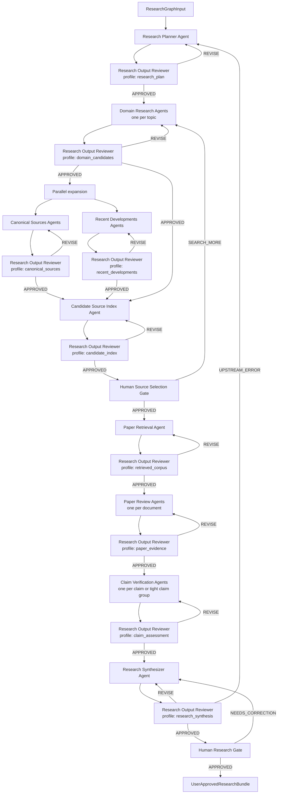

# Research Graph, architektura agentów i skilli

## 1. Architektura logiczna



Wszystkie pola oznaczone jako `Research Output Reviewer` są uruchomieniami tej samej
fizycznej definicji agenta.

## 2. Fizyczne definicje agentów

Moduł zawiera dziesięć plików agentów (płasko w `agents/`, auto-discovery; nazwy
namespace'owane prefiksem `research-` — bez dublowania, gdy nazwa już zawiera „research"):

1. `research-planner.md`
2. `domain-research.md`
3. `research-canonical-sources.md`
4. `research-recent-developments.md`
5. `research-candidate-source-index.md`
6. `research-paper-retrieval.md`
7. `research-paper-review.md`
8. `research-claim-verification.md`
9. `research-synthesizer.md`
10. `research-output-reviewer.md`

`User Source Selection Gate` i `User Research Gate` są krokami orkiestratora. Nie wymagają
osobnych agentów.

## 3. Standard pliku agenta

Docelowe pliki są po angielsku i zachowują następującą strukturę:

```markdown
agent: **Research: Agent Name**

Short description of the isolated responsibility and why its boundary matters.

## Contract

Input, output, consumes, produces, required artifact refs and envelope behavior.

## Required Skills

Mandatory skills, optional skills and allowed execution order.

## Workflow

Numbered execution procedure.

## Acceptance Criteria

Criteria later passed to the universal reviewer as a review profile.

## Boundaries

Non-responsibilities, prohibited actions and scope constraints.

## Failure handling

Degraded results, needs_input, blocked dependencies and escalation data.

## Resume

Stateless re-run behavior and handling of revision items.
```

Każdy agent:

- jest izolowany,
- nie rozmawia bezpośrednio z użytkownikiem,
- otrzymuje ograniczony input bundle,
- korzysta tylko z wymienionych skilli,
- zwraca `envelope@1`,
- zapisuje wyniki jako artefakty,
- nie wykonuje odpowiedzialności następnego etapu,
- przy rewizji otrzymuje poprzedni artefakt i konkretne `revision_items`.

## 4. Standard skilla

Każdy skill znajduje się w `skills/<skill-name>/SKILL.md` (jeden poziom — Claude Code nie
wykrywa zagnieżdżenia `skills/<graph>/<name>/`). Każdy katalog skilla zawiera również wymagany
folder `adapters/`. Dodatkowe zasoby powstają tylko wtedy, gdy są potrzebne do deterministycznego
i powtarzalnego wykonania procedury.

```markdown
---
name: skill-name
description: What the skill does, when an authorized research agent must use it, and its scope.
---

# Skill Name

## Contract
## Workflow
## Output requirements
## Boundaries
## Failure handling
## Resume
```

Opis musi jednoznacznie wskazywać, czy skill jest interaktywnym orkiestratorem, czy procedurą
wykonawczą uruchamianą przez agenta. Skille wykonawcze nie prowadzą rozmowy z użytkownikiem.

### Frontmatter i adaptery (ograniczenia buildu)

`scripts/build-plugin.py` parsuje frontmatter **mini-podzbiorem YAML** (`key: scalar`, jedna
linia na klucz). Stąd zasady, których autor skilla musi przestrzegać:

- **Neutralny `SKILL.md`** ma we frontmatterze **wyłącznie `name` i `description`** — każde jako
  pojedyncza linia (bez bloków `>-`/`|`, bez list/map). Cudzysłowy `"..."`/`'...'` są dozwolone.
  `name` musi równać się nazwie folderu.
- **Frontmatter zależny od hosta** (np. `model: opus`) idzie do
  `adapters/<host>.frontmatter.yaml` — build nakłada go na neutralny frontmatter. Overlay
  **nie może** zmienić `name`.
- **Treść zależna od hosta** idzie do `adapters/<host>.md` (nie może być pusta). Build wstawia ją
  w miejsce `{{HOST_ADAPTER}}` w ciele `SKILL.md`, a gdy placeholdera brak — **dokleja na końcu**.
- W zbudowanym bundlu folder `adapters/` **jest usuwany** (host dostaje tylko swój wariant).
- Wymagane pliki na skill: `adapters/claude.md`, `adapters/codex.md`, `adapters/claude.frontmatter.yaml`.

Struktura host adapters:

```text
skills/<skill-name>/
├── SKILL.md
└── adapters/
    ├── claude.frontmatter.yaml
    ├── claude.md
    └── codex.md
```

`SKILL.md` zawiera wyłącznie wspólną semantykę. `claude.frontmatter.yaml` wybiera model Claude
dla danego skilla, `claude.md` opisuje Task/Agent i narzędzia Claude Code, a `codex.md` opisuje
powierzchnię MCP lub równoważny adapter Codex. Renderowanie wykonuje krok buildu
`scripts/build-plugin.py` (funkcja `render_skill_adapters`): nakłada `<host>.frontmatter.yaml` na
neutralny frontmatter, wstawia treść `<host>.md` w miejsce `{{HOST_ADAPTER}}` (albo dokleja na
końcu) i **usuwa katalog `adapters/`** z bundla — wariant instalacyjny powstaje bez modyfikacji
źródła i bez instrukcji drugiego hosta.

### 4.1. Deterministyczne narzędzia skilli

Skille wyszukiwania, indeksowania, Open Access i pobierania korzystają z narzędzi Research
Graph zamiast samodzielnie konstruować requesty w kontekście LLM. Narzędzie przyjmuje JSON,
zwraca JSON i nie podejmuje decyzji semantycznych należących do agenta.

Wspólny wynik operacji narzędzia zawiera co najmniej:

- `operation_id`, `provider`, `status` i czas wykonania,
- znormalizowane `records` albo deskryptory pobranych plików,
- `query_log`, proweniencję oraz identyfikatory dostawcy,
- informacje o paginacji, limitach i częściowych brakach,
- strukturalne `issues` bez ukrywania degradacji.

Provider adapters obejmują w pierwszej kolejności OpenAlex, Semantic Scholar, arXiv i
Unpaywall. Crossref, CORE, DOAB i OAPEN pełnią funkcje uzupełniające. Agent wybiera strategię,
a adapter wykonuje zapytanie, normalizuje odpowiedź i zachowuje jej pochodzenie.

## 5. Agenci wykonawczy

### 5.1. Research Planner Agent

**Cel:** zamienić zatwierdzony input na ograniczony plan badań.

**Odpowiedzialności:**

- pogrupować research drivers w topics,
- określić cel każdego topic,
- wskazać powiązane claimy, koncepty i potrzeby aktualizacji,
- zdefiniować role źródeł i coverage requirements,
- przygotować strategię wyszukiwania,
- ustalić priorytety, limity i warunki zakończenia.

**Granice:**

- nie wyszukuje publikacji,
- nie ocenia claimów,
- nie proponuje zmian slajdów,
- nie rozszerza zatwierdzonego zakresu.

**Wejście:** `ResearchGraphInput`.

**Wyjście:** `ResearchPlan`.

### 5.2. Domain Research Agent

Uruchamiany osobno dla każdego topic.

**Cel:** zbudować bazową pulę kandydatów powiązanych z topic i jego research needs.

**Odpowiedzialności:**

- rozwinąć zapytanie w zatwierdzonych granicach,
- przeszukać główny indeks metadanych,
- zebrać rekordy i ślad zapytań,
- mapować kandydatów do coverage units,
- zachować źródła wspierające, kwalifikujące i potencjalnie krytyczne.

**Granice:**

- nie potwierdza claimów,
- nie tworzy finalnego rankingu,
- nie pobiera PDF,
- nie decyduje o kanoniczności poza wstępnym sygnałem.

**Wejście:** topic z `ResearchPlan` oraz zatwierdzona strategia.

**Wyjście:** `DomainCandidateSources`.

### 5.3. Canonical Sources Agent

Uruchamiany po bazowym Domain Research, osobno dla topic lub domeny.

**Cel:** uzupełnić pulę o źródła fundamentalne, monografie, podręczniki, przeglądy i ważne
prace metodologiczne.

**Odpowiedzialności:**

- analizować sygnały cytowań i centralności,
- rozszerzać graf wstecz i wokół kluczowych źródeł,
- oddzielać canonical anchor od dostępnego dowodu,
- rejestrować źródła zamknięte,
- wskazywać źródła dostępne, które mogą uzupełnić zamkniętą monografię.

**Granice:**

- nie przypisuje treści niedostępnej książce,
- nie traktuje liczby cytowań jako jakości naukowej,
- nie pobiera dokumentów,
- nie wykonuje pełnego review.

**Wyjście:** `CanonicalCandidateSources`.

### 5.4. Recent Developments Agent

Uruchamiany równolegle z Canonical Sources po Domain Research.

**Cel:** znaleźć aktualne, dojrzałe zmiany istotne dla zatwierdzonego topic lub claimu.

**Odpowiedzialności:**

- korzystać z recency window,
- analizować dynamikę cytowań i powiązania grafowe,
- odróżniać core update od optional trend,
- oznaczać maturity level,
- rejestrować preprinty jako odrębną kategorię.

**Granice:**

- nie zastępuje materiału kanonicznego,
- nie uznaje nowości za jakość,
- nie generuje treści slajdów,
- nie pobiera dokumentów.

**Wyjście:** `RecentCandidateSources`.

### 5.5. Candidate Source Index Agent

**Cel:** przygotować wiarygodny i czytelny indeks do decyzji człowieka.

**Odpowiedzialności:**

- agregować trzy strumienie kandydatów,
- normalizować metadane,
- deduplikować rekordy,
- przypisywać role źródeł,
- tworzyć osobne sygnały canonical i rising,
- sprawdzać candidate coverage,
- wybierać pulę prezentowaną i rezerwową,
- generować opisy LLM wyłącznie z dostępnych abstraktów,
- tworzyć `candidate_source_index.json` i `candidate_source_review.md`.

**Granice:**

- nie podejmuje ostatecznej decyzji o pobraniu,
- nie przedstawia opisu abstraktowego jako pełnej weryfikacji,
- nie tworzy metadanych bibliograficznych przez LLM,
- nie usuwa zamkniętych źródeł tylko z powodu braku OA.

**Wyjście:** `CandidateSourceIndex` i human-readable review document.

### 5.6. Paper Retrieval Agent

**Cel:** pobrać lub zarejestrować wyłącznie źródła zatwierdzone przez człowieka.

**Odpowiedzialności:**

- rozwiązać dostęp OA zgodnie z zatwierdzonym łańcuchem,
- pobierać wyłącznie legalne, dostępne wersje,
- sprawdzać typ i integralność dokumentu,
- tworzyć stabilne powiązanie `source_id` z plikiem,
- rejestrować unavailable, failed i library access,
- nie pobierać ponownie posiadanych plików, jeżeli runtime dostarcza manifest.

**Granice:**

- nie ocenia jakości naukowej,
- nie zmienia wyboru człowieka,
- nie analizuje treści,
- nie automatyzuje dostępu instytucjonalnego.

**Wyjście:** `RetrievedCorpus`.

### 5.7. Paper Review Agent

Uruchamiany osobno dla jednego dokumentu.

**Cel:** wydobyć z dokumentu dowody potrzebne downstream bez przekazywania pełnego PDF.

**Odpowiedzialności:**

- zlokalizować sekcje związane z przypisanymi claimami i topics,
- wydobyć contribution, method, findings i limitations,
- zapisać lokalizację dowodu,
- oddzielić twierdzenia publikacji od interpretacji dla wykładu,
- wskazać dowody wspierające, sprzeczne i kontekstualizujące,
- określić evidence access level.

**Granice:**

- nie czyta całego dokumentu bez potrzeby,
- nie wykonuje ostatecznej oceny claimu,
- nie proponuje finalnych zmian slajdów,
- nie ignoruje ograniczeń publikacji.

**Wyjście:** `PaperReview` oraz `PaperEvidenceCards`.

### 5.8. Claim Verification Agent

Uruchamiany po zaakceptowanych Paper Reviews, osobno dla claimu lub ściśle powiązanego pakietu.

**Cel:** ocenić claim w wielu wymiarach na podstawie zatwierdzonych evidence cards.

**Odpowiedzialności:**

- ocenić wsparcie dowodowe,
- ocenić aktualność,
- ocenić adekwatność dydaktyczną,
- rozpoznać kontrowersyjność,
- przypisać confidence z uzasadnieniem,
- wskazać rekomendowaną akcję,
- oznaczyć niewystarczające dowody,
- poprosić o ukierunkowany drugi odczyt, jeśli brakuje konkretnego fragmentu.

**Granice:**

- nie korzysta bezpośrednio z pełnego korpusu,
- nie zmienia claimu bez zachowania oryginalnej treści,
- nie tworzy finalnego planu zmian,
- nie ukrywa sprzecznych dowodów.

**Wyjście:** `ClaimAssessmentState`.

### 5.9. Research Synthesizer Agent

**Cel:** utworzyć kompaktowy, dowodowy pakiet dla człowieka i Solution Graph.

**Odpowiedzialności:**

- połączyć claim assessments, paper evidence, źródła kanoniczne i recent developments,
- utworzyć `ResearchState`,
- utworzyć `EvidenceMap`,
- rozdzielić required updates i optional improvements,
- wskazać unresolved claims,
- przygotować `UserResearchValidationPacket`,
- przygotować `SolutionInputCandidate` bez pełnego korpusu.

**Granice:**

- nie pisze slajdów,
- nie tworzy finalnego planu zmian,
- nie dodaje nowych dowodów podczas syntezy,
- nie przekazuje pełnych PDF-ów do Solution Graph.

## 6. Uniwersalny reviewer

### 6.1. Research Output Reviewer Agent

**Cel:** sprawdzić, czy konkretny agent wykonał przydzielone zadanie zgodnie z kontraktem i
profilem etapu.

**Wejście:**

- oryginalne zadanie producenta,
- ograniczony input producenta,
- artefakt wynikowy,
- expected output contract,
- acceptance criteria,
- evidence requirements,
- prohibited behaviors,
- severity rules,
- poprzednie findings i numer próby.

**Wyjście:** `ReviewDecision`.

**Decyzje:**

- `APPROVED`,
- `REVISE`,
- `BLOCKED`.

**Root cause:**

- `producer_error`,
- `insufficient_evidence`,
- `invalid_or_incomplete_input`,
- `upstream_plan_error`,
- `review_profile_error`,
- `external_dependency_blocked`.

**Zasady:**

- reviewer nie poprawia artefaktu,
- reviewer nie rozszerza kryteriów poza review profile,
- każde finding wskazuje criterion, location, severity i required correction,
- rewizja ma minimalny zakres,
- brak lub sprzeczność kryteriów prowadzi do `BLOCKED`,
- reviewer otrzymuje artefakt i kontrakt, bez prywatnego toku rozumowania producenta,
- osobne artefakty są oceniane w osobnych wywołaniach.

## 7. Profile review

| Profile | Najważniejsze kryteria |
|---|---|
| `research_plan` | Każdy topic ma purpose, research drivers, role źródeł, coverage i stop rule. |
| `domain_candidates` | Kandydaci mapują się do topic, zapytania są w zakresie, metadane pochodzą z indeksów. |
| `canonical_sources` | Kanoniczność ma podstawę, access level jest jawny, zamknięta treść nie jest interpretowana. |
| `recent_developments` | Recency i maturity są jawne, hype jest oddzielony od dojrzałej aktualizacji. |
| `candidate_index` | Deduplikacja, role, ranking, pokrycie, opisy oparte na abstraktach, dokument dla człowieka. |
| `retrieved_corpus` | Tylko zatwierdzone źródła, stabilne ID, integralne pliki, jawne błędy i unavailable. |
| `paper_evidence` | Evidence location, metoda, findings, ograniczenia, relacja z claimem i access level. |
| `claim_assessment` | Wszystkie wymiary oceny, dowody przeciwne, confidence i coverage. |
| `research_synthesis` | Każda rekomendacja ma evidence refs, unresolved są jawne, handoff jest kompaktowy. |

## 8. Proponowany katalog skilli

Nazwy są robocze, ale funkcje powinny pozostać rozdzielone.

| Skill | Główna funkcja |
|---|---|
| `plan-research-scope` | Topics, research needs, source strategy, coverage i stop rules. |
| `expand-research-query` | Kontrolowane synonimy, terms, topics i wyłączenia. |
| `search-scholarly-metadata` | Wyszukiwanie realnych rekordów bibliograficznych. |
| `expand-citation-graph` | Rozszerzenie od seed sources i relacji cytowań. |
| `classify-source-role` | Canonical, recent, survey, didactic, claim-specific, optional. |
| `normalize-source-metadata` | Ujednolicenie DOI, autorów, roku, typu i identyfikatorów. |
| `deduplicate-source-records` | Łączenie rekordów z wielu indeksów. |
| `rank-source-candidates` | Osobne sygnały canonical i rising oraz priorytet coverage. |
| `annotate-source-candidates` | Krótkie, ugruntowane w abstrakcie opisy dla człowieka. |
| `assess-source-coverage` | Candidate, selection i evidence coverage. |
| `resolve-open-access` | Ustalenie legalnej dostępnej wersji dokumentu. |
| `retrieve-open-access-document` | Pobranie zatwierdzonego dokumentu. |
| `validate-retrieved-document` | Integralność, typ, zgodność source ID i status. |
| `extract-paper-evidence` | Ukierunkowane wydobycie evidence cards z dokumentu. |
| `assess-claim-evidence` | Wielowymiarowa ocena claimu. |
| `synthesize-research-findings` | ResearchState, EvidenceMap i handoff. |
| `review-research-output` | Uniwersalna procedura review względem profile. |
| `orchestrate-research` | Rozmowa, routing, reviewer loops i human gates. |

## 9. Macierz agentów i skilli

| Agent | Wymagane skille | Opcjonalne skille |
|---|---|---|
| Research Planner | `plan-research-scope` | `expand-research-query` do planu terminów, bez wyszukiwania |
| Domain Research | `expand-research-query`, `search-scholarly-metadata` | `expand-citation-graph` |
| Canonical Sources | `expand-citation-graph`, `classify-source-role`, `search-scholarly-metadata` | `normalize-source-metadata` |
| Recent Developments | `expand-research-query`, `search-scholarly-metadata`, `classify-source-role` | `expand-citation-graph` |
| Candidate Source Index | `normalize-source-metadata`, `deduplicate-source-records`, `classify-source-role`, `rank-source-candidates`, `annotate-source-candidates`, `assess-source-coverage` | brak na start |
| Paper Retrieval | `resolve-open-access`, `retrieve-open-access-document`, `validate-retrieved-document` | brak na start |
| Paper Review | `extract-paper-evidence` | ukierunkowane ponowne wydobycie |
| Claim Verification | `assess-claim-evidence`, `assess-source-coverage` | brak na start |
| Research Synthesizer | `synthesize-research-findings`, `assess-source-coverage` | brak na start |
| Research Output Reviewer | `review-research-output` | read-only użycie odpowiedniego skilla sprawdzającego, jeśli review profile tego wymaga |

## 10. Human Source Selection Gate

### 10.1. Co człowiek otrzymuje

- krótkie podsumowanie w rozmowie,
- ścieżkę lub link do `candidate_source_review.md`,
- liczbę kandydatów i wykryte luki,
- instrukcję decyzji,
- gotowy szablon odpowiedzi.

### 10.2. Instrukcja

Orkiestrator generuje instrukcję w `output_language` przy każdym wejściu do bramki:

```text
A candidate source review is ready.

1. Open: <artifact path>
2. Review the short descriptions and coverage notes.
3. Assign one action to each source you want to keep or reject.

DOWNLOAD      Retrieve an available Open Access document.
LIBRARY       Keep it and request institutional or library access.
CITATION      Keep it as contextual citation without retrieval.
RESERVE       Keep it available as a replacement.
EXCLUDE       Remove it from this research run.
SEARCH_MORE   Ask for more candidates for a topic, claim or missing source role.

Reply using the copyable template below. Natural language is also accepted.

DOWNLOAD: SRC_...
LIBRARY: SRC_...
CITATION: SRC_...
RESERVE: SRC_...
EXCLUDE: SRC_..., reason: ...
SEARCH_MORE: CLM_... or TOPIC_..., need: ...
```

Orkiestrator parsuje odpowiedź, pokazuje podsumowanie i prosi o finalne potwierdzenie.

### 10.3. Powrót do wyszukiwania

`SEARCH_MORE` musi zawierać claim, topic albo brakującą rolę. Orkiestrator kieruje żądanie do
Domain, Canonical lub Recent zgodnie z typem luki. Po rozszerzeniu Candidate Source Index jest
budowany ponownie, reviewer ocenia nową wersję, a człowiek otrzymuje zaktualizowany dokument.

## 11. Human Research Gate

Człowiek otrzymuje:

- podsumowanie zweryfikowanych claimów,
- required updates,
- optional improvements,
- unresolved claims,
- poziomy confidence,
- evidence coverage,
- źródła i ograniczenia,
- decyzje wymagane przed przekazaniem do Solution Graph.

Człowiek zatwierdza, odrzuca lub kieruje syntezę do korekty. Finalny pakiet zawiera również
świadomie zaakceptowane wyjątki i politykę obsługi nierozstrzygniętych claimów.

## 12. Współbieżność

- Domain Research działa równolegle per topic.
- Canonical i Recent działają równolegle po zatwierdzeniu bazowej puli.
- Paper Review działa równolegle per dokument.
- Claim Verification może działać równolegle per niezależny claim lub ciasny claim group.
- Reviewer ocenia każdy artefakt oddzielnie.
- Fan-in następuje dopiero po zatwierdzeniu wszystkich wymaganych wyników albo oznaczeniu
  jawnych wyjątków.

## 13. Failure handling

Agenci używają wspólnej semantyki envelope:

- `ok`, artefakt gotowy do review,
- `needs_input`, potrzebna decyzja użytkownika przekazana przez orkiestratora,
- `degraded`, użyteczny wynik z jawnymi brakami,
- `failed`, brak użytecznego artefaktu.

Decyzje reviewera są zapisane w `ReviewDecision`, nie w statusie envelope.

Przykładowe sytuacje degraded:

- brak abstraktu dla części źródeł,
- niedostępny pełny tekst,
- częściowe pokrycie topic,
- niedostępność jednego indeksu przy działającym źródle głównym.

Przykładowe sytuacje blocked:

- brak wymaganych research drivers,
- sprzeczny review profile,
- wszystkie wymagane źródła zewnętrzne niedostępne,
- potrzeba decyzji człowieka, której agent nie może bezpiecznie założyć.


## 14. Model wykonania i parytet hostów

Wykonanie jest **per host**, rdzeń pozostaje agnostyczny:

- **Claude:** orkiestrator-skill prowadzi izolowanych subagentów przez Task tool (model „w cenie"
  subskrypcji); deterministyczne szwy przez MCP.
- **Codex:** silnik `research_flow.run` prowadzi graf, a każdy węzeł to izolowany `codex exec`
  (`research_flow.py run-codex`), na loginie ChatGPT (bez API key).

Ujednolicenie do jednej ścieżki odrzucono: Task nie jest wołalny z Pythona, a wołanie API LLM
dla Claude wymagałoby klucza i kosztu poza subskrypcją.

**Parytet utrzymujemy przez jedno źródło prawdy — manifest grafu** (`shared/graphs/<graph>.graph.json`):
sekwencja węzłów, `review_profile`, `retry_matrix`, `complexity_class`, `model_bindings`,
`required_decisions`. Obie ścieżki z niego czerpią; żadna nie hardkoduje polityki. `graph_check`
wymusza, że skill-orkiestrator odwołuje się do manifestu (łapie rozjazd, gdy ktoś skopiuje
przepływ do promptu).
