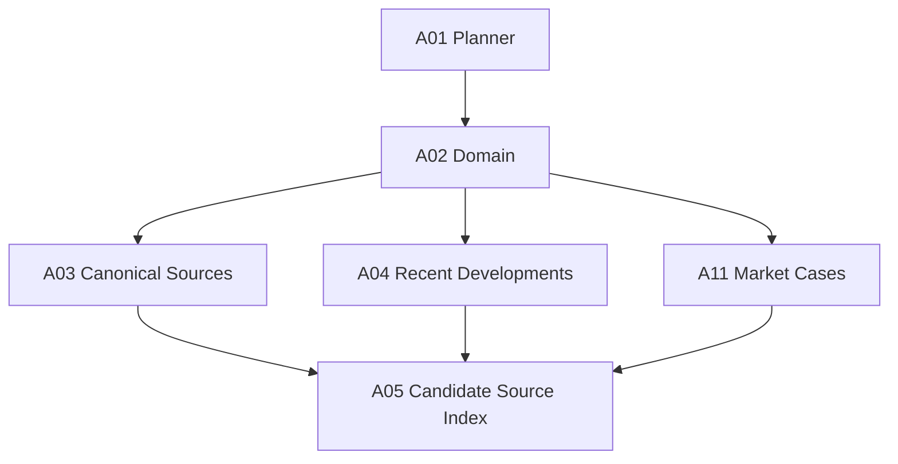

# Optymalizacja kosztu, czasu i effortów Research Graph

Status: notatka robocza do powrotu po kolejnych testach w osobnym środowisku.

Data zapisu: 2026-06-23.

Zakres: G02 Research Graph, modele Claude, efforty, koszt tokenowy, czas ścienny, miejsca możliwej optymalizacji bez obniżania wiarygodności naukowej.

## 1. Kontekst

Poprzednie testy pokazały, że schemat G02 potrafi pracować zbyt długo i nie jest optymalny tokenowo. Po ostatniej zmianie macierz modeli i effortów została ustawiona bardziej jakościowo niż kosztowo. Ta notatka zapisuje ocenę aktualnego stanu oraz możliwe dalsze kierunki optymalizacji, jeśli następne testy potwierdzą, że narzędzie ma być tańsze i szybsze.

Ta notatka nie zmienia obowiązującej konfiguracji. Obowiązującym źródłem technicznym pozostaje `shared/graphs/g02.graph.json` oraz frontmatter w `skills/*/adapters/claude.frontmatter.yaml`.

## 2. Aktualna macierz agentów po ostatnich zmianach

| Agent | Model | Effort | Rola w grafie |
|---|---|---|---|
| `g02-a01-planner` | opus | medium | planowanie zakresu, topiców, coverage i stop rules |
| `g02-a02-domain` | sonnet | high | szeroka pula bazowa źródeł dla topicu |
| `g02-a03-canonical-sources` | sonnet | high | źródła kanoniczne, citation expansion, role źródeł |
| `g02-a04-recent-developments` | sonnet | high | aktualne publikacje i recent developments |
| `g02-a05-candidate-source-index` | opus | medium | agregacja, deduplikacja, ranking i human source gate |
| `g02-a06-paper-retrieval` | sonnet | high | retrieval, OA resolution, download, walidacja dokumentów |
| `g02-a07-paper-review` | opus | high | ekstrakcja evidence cards z dokumentów lub zatwierdzonych market cases |
| `g02-a08-claim-verification` | opus | medium | ocena claimów względem evidence cards |
| `g02-a09-synthesizer` | opus | high | finalna synteza ResearchState, EvidenceMap i handoff |
| `g02-a10-output-reviewer` | sonnet | xhigh | uniwersalny reviewer po etapach producenckich |
| `g02-a11-market-cases` | sonnet | high | przypadki rynkowe przez kontrolowany web discovery |

## 3. Aktualne globalne bindingi

| Binding | Model | Effort |
|---|---|---|
| `cross_artifact_reconciliation` | opus | medium |
| `deterministic_technical` | sonnet | medium |
| `evidence_high_impact` | sonnet | medium |
| `research_planning` | opus | medium |
| `research_search` | sonnet | medium |
| `synthesis_decision` | opus | medium |

Globalne bindingi są sensowne jako domyślne klasy zadań. Rozjazdy między nimi a agentami wynikają z nadpisania per agent. To jest użyteczne, ale trzeba pilnować, żeby nie powstały przypadkowe wysokie efforty tam, gdzie praca jest deterministyczna.

## 4. Aktualna macierz skillów

| Skill | Model | Effort | Uwagi kosztowe |
|---|---|---|---|
| `g02-a01-plan-research-scope` | opus | medium | razem z A01 może zwiększać koszt planowania |
| `g02-a05-annotate-source-candidates` | opus | medium | uzasadnione, wpływa na decyzję człowieka |
| `g02-a05-deduplicate-source-records` | opus | medium | potencjalnie do obniżenia, jeśli deduplikacja jest dobrze deterministyczna |
| `g02-a05-rank-source-candidates` | opus | medium | sensowne, bo ranking wpływa na bramkę źródeł |
| `g02-a06-resolve-open-access` | sonnet | high | prawdopodobnie za wysoko dla pracy w dużej mierze narzędziowej |
| `g02-a06-retrieve-open-access-document` | sonnet | high | prawdopodobnie za wysoko, jeśli kod obsługuje download i walidację |
| `g02-a06-validate-retrieved-document` | sonnet | high | prawdopodobnie za wysoko, walidacja powinna być głównie deterministyczna |
| `g02-a07-extract-paper-evidence` | opus | high | jakościowo uzasadnione, ale koszt skaluje się z liczbą dokumentów |
| `g02-a08-assess-claim-evidence` | opus | medium | sensowny kompromis |
| `g02-a09-synthesize-research-findings` | opus | high | możliwe obniżenie do medium, jeśli wcześniejsze artefakty są dobre |
| `g02-a11-extract-case-evidence` | opus | high | kosztowne, używane warunkowo przy market case |
| `g02-a11-find-market-cases` | sonnet | high | możliwe obniżenie do medium dla szybszego profilu |
| `g02-assess-source-coverage` | opus | high | wspólny skill A08/A09; obecnie ustawiony pod bardziej wymagającego konsumenta |
| `g02-classify-source-role` | sonnet | high | możliwe obniżenie do medium, jeśli role mają dobre kryteria |
| `g02-expand-citation-graph` | sonnet | high | zostawić high przy canonical sources, bo błędy mogą propagować downstream |
| `g02-expand-research-query` | sonnet | high | możliwe obniżenie do medium przy dobrze zdefiniowanych topicach |
| `g02-normalize-source-metadata` | sonnet | high | możliwe obniżenie, jeśli normalizacja jest wspierana kodem |
| `g02-orchestrate-research` | opus | low | sensowne, bo orkiestrator nie powinien wykonywać pracy producentów |
| `g02-review-research-output` | sonnet | xhigh | prawdopodobnie za ciężki, bo reviewer występuje wielokrotnie |
| `g02-search-scholarly-metadata` | sonnet | high | możliwe medium, jeśli provider tools i Crossref dobrze walidują rekordy |
| `g02-verify-doi-metadata` | sonnet | high | możliwe medium, ponieważ Crossref daje deterministyczny punkt odniesienia |

## 5. Ocena aktualnej konfiguracji

Obecna konfiguracja ma sens jakościowo, ale nie jest jeszcze dobrze zoptymalizowana kosztowo ani czasowo. Raczej przesuwa system w stronę wysokiej pewności i dłuższego namysłu niż w stronę szybkiego, taniego narzędzia researchowego.

Największe źródła kosztu i czasu:

| Obszar | Ocena |
|---|---|
| A10 reviewer `sonnet/xhigh` | Prawdopodobnie za ciężki, bo reviewer pojawia się po prawie każdym producencie. Jedno review na etap ogranicza pętle, ale nadal mnoży koszt przez liczbę etapów. |
| A01 planner `opus/medium` | Ryzykowne tokenowo. Planner wcześniej pracował długo, a Opus może wydłużyć planowanie. Tu potrzebny jest raczej krótki, mocno ograniczony plan niż głębsze rozumowanie. |
| A06 retrieval `sonnet/high` | Za wysoko. To jest w dużej mierze techniczno-deterministyczny agent. Legalność, hash, typ pliku, zgodność DOI i status dostępności powinny być walidowalne narzędziowo. |
| A07 paper review `opus/high` | Uzasadnione jakościowo, ale potencjalnie największy koszt, bo skaluje się z liczbą dokumentów i długością tekstu. |
| A09 synthesizer `opus/high` | Może być zbyt ciężki, jeśli wcześniejsze etapy już produkują dobre evidence cards i claim assessments. |
| Serialny przebieg A03, A04, A11 | To jest główny problem czasu ściennego. Po A02 te etapy są logicznie niezależne i mogą iść równolegle. |
| Skille współdzielone | `g02-assess-source-coverage` jako `opus/high` jest konserwatywny, ale kosztowny. Jeden frontmatter dla wielu konsumentów utrudnia precyzyjne strojenie kosztu. |

## 6. Najważniejsze rekomendacje zmian, jeśli testy potwierdzą problem

Największy zwrot powinny dać zmiany A10, A01, A06 i A09.

| Element | Obecnie | Propozycja optymalna |
|---|---|---|
| `g02-a01-planner` | opus/medium | sonnet/medium albo sonnet/high |
| `g02-a02-domain` | sonnet/high | sonnet/medium |
| `g02-a03-canonical-sources` | sonnet/high | sonnet/high zostawić |
| `g02-a04-recent-developments` | sonnet/high | sonnet/medium albo high tylko dla tematów z dużą zmiennością |
| `g02-a05-candidate-source-index` | opus/medium | opus/medium zostawić albo sonnet/high |
| `g02-a06-paper-retrieval` | sonnet/high | sonnet/low albo sonnet/medium |
| `g02-a07-paper-review` | opus/high | opus/medium, z eskalacją do high tylko dla trudnych dokumentów |
| `g02-a08-claim-verification` | opus/medium | opus/medium zostawić |
| `g02-a09-synthesizer` | opus/high | opus/medium |
| `g02-a10-output-reviewer` | sonnet/xhigh | sonnet/low albo sonnet/medium |
| `g02-a11-market-cases` | sonnet/high | sonnet/medium albo high tylko dla ważnych market-case needs |

Szczególna uwaga: `xhigh` dla A10 trzeba sprawdzić w realnym runtime. Jeśli host nie obsługuje tej wartości albo traktuje ją jako bardzo drogi tryb, należy przejść na `high`, `medium` albo `low`, zależnie od wyników testów.

## 7. Rekomendowana macierz balanced

To jest proponowany kompromis między wiarygodnością i kosztem:

| Agent | Model | Effort |
|---|---|---|
| `g02-a01-planner` | sonnet | medium |
| `g02-a02-domain` | sonnet | medium |
| `g02-a03-canonical-sources` | sonnet | high |
| `g02-a04-recent-developments` | sonnet | medium |
| `g02-a05-candidate-source-index` | opus | medium |
| `g02-a06-paper-retrieval` | sonnet | medium |
| `g02-a07-paper-review` | opus | medium |
| `g02-a08-claim-verification` | opus | medium |
| `g02-a09-synthesizer` | opus | medium |
| `g02-a10-output-reviewer` | sonnet | medium |
| `g02-a11-market-cases` | sonnet | medium lub high |

Jeśli priorytetem jest szybkość, A10 można testowo ustawić nawet na `sonnet/low`, ponieważ deterministic validators powinny wykrywać błędy schematów i braków formalnych.

## 8. Możliwe profile wykonania

Docelowo warto nie przepisywać macierzy ręcznie, tylko dodać profile wykonania. Przykładowe profile:

### 8.1. Profil `fast`

Dla szybkich, tanich przebiegów, w których priorytetem jest orientacyjny research z kontrolowanym ryzykiem.

| Agent | Model | Effort |
|---|---|---|
| A01 | sonnet | medium |
| A02 | sonnet | medium |
| A03 | sonnet | medium |
| A04 | sonnet | medium |
| A05 | sonnet albo opus | medium |
| A06 | sonnet | low |
| A07 | opus | medium |
| A08 | opus | medium |
| A09 | opus | medium |
| A10 | sonnet | low |
| A11 | sonnet | medium |

Warunki bezpieczeństwa dla `fast`: zachować Crossref, zachować walidację kontraktów, zachować jeden A10 review, ograniczyć liczbę źródeł i dokumentów.

### 8.2. Profil `balanced`

Dla normalnego użycia edukacyjno-akademickiego, gdzie potrzebna jest wiarygodność, ale narzędzie nie może pracować bardzo długo.

Macierz jak w sekcji 7.

### 8.3. Profil `strict`

Dla zadań o wysokiej stawce, trudnych dokumentów, konfliktów DOI, claimów centralnych dla materiału albo gdy wynik ma trafić do publikowalnego research packa.

| Agent | Model | Effort |
|---|---|---|
| A01 | opus albo sonnet | medium |
| A02 | sonnet | high |
| A03 | sonnet | high |
| A04 | sonnet | high |
| A05 | opus | medium |
| A06 | sonnet | medium |
| A07 | opus | high |
| A08 | opus | medium albo high |
| A09 | opus | high |
| A10 | sonnet albo opus | medium |
| A11 | sonnet | high |

W profilu `strict` nadal nie ma potrzeby automatycznie ustawiać A10 na najwyższy effort dla każdego etapu. Reviewer powinien być wspierany przez deterministic validation i czytać skrócony pakiet kontrolny, a nie pełne artefakty bez potrzeby.

## 9. Adaptive effort zamiast stałego effortu

Najlepszy kierunek to adaptive effort:

1. Startować od `medium`.
2. Eskalować tylko wtedy, gdy wystąpi jeden z warunków:
   - konflikt Crossref po DOI,
   - sprzeczne evidence cards,
   - brak wymaganego coverage,
   - wysokostawkowy claim centralny dla materiału,
   - duża rozbieżność między źródłami kanonicznymi i recent developments,
   - dokument trudny metodologicznie lub zawierający niejednoznaczne wyniki empiryczne,
   - reviewer widzi błąd materialny, którego deterministic validators nie domykają.
3. Nie eskalować przy brakach czysto formalnych, które da się wykryć i opisać deterministycznie.

Takie podejście pozwala utrzymać wiarygodność tam, gdzie jest potrzebna, bez płacenia najwyższym effortem w każdym przebiegu.

## 10. Najważniejsza poprawka architektoniczna: fan-out po A02

Modele i efforty nie rozwiążą całego problemu. Największy zysk czasu ściennego da równoleglenie logicznie niezależnych etapów po A02.

To nie zmniejszy liczby tokenów samo w sobie, ale może mocno skrócić czas pracy użytkownika. Aktualny runner wykonuje sekwencję. Docelowy scheduler powinien mieć fan-out/fan-in po zatwierdzonym lub poprawionym A02.

Ryzyka fan-out:

- trzeba dobrze obsłużyć artifact locking i refs,
- `research_run_report@1` musi zachować czytelny porządek wyników,
- błędy w jednym ramieniu nie powinny kasować diagnostyki pozostałych ramion,
- A05 musi przyjmować komplet zatwierdzonych albo poprawionych upstream artifacts.

## 11. Odchudzenie A10 review

A10 powinien być tani, bo jest uruchamiany wiele razy. Największy potencjał:

1. Reviewer powinien dostawać skrócony pakiet kontrolny:
   - `artifact_ref`,
   - typ kontraktu,
   - review profile,
   - deterministic validation summary,
   - listę acceptance criteria z pass/fail/unknown,
   - krótkie delty lub próbki,
   - link do pełnego artefaktu tylko jako fallback.
2. Pełny artefakt powinien być czytany tylko gdy:
   - validation summary wskazuje konflikt,
   - kryterium wymaga oceny semantycznej,
   - producer zwrócił niejednoznaczne lub niekompletne uzasadnienie.
3. `REVISE` powinno być rzadkie:
   - tylko dla materialnych braków,
   - nie dla drobnych uwag stylistycznych,
   - advisory findings powinny pozostać nieblokujące.
4. Dla oczywistych błędów schematu reviewer może być pominięty albo pracować na minimalnym summary, ponieważ schema validator już dostarcza podstawę decyzji.

## 12. Odchudzenie A01 planner

A01 wcześniej pracował długo. Zwiększanie go do Opus może pogorszyć czas i koszt. Planner powinien być sterowany mocnymi ograniczeniami:

- limit topiców,
- limit coverage units,
- limit source roles,
- limit długości uzasadnień,
- zakaz rozwijania adjacent topics poza zatwierdzony scope,
- twarde stop rules,
- brak literatury i brak wyszukiwania.

Jeśli testy pokażą, że A01 nadal jest wolny, pierwsza zmiana powinna być na `sonnet/medium`, ewentualnie `sonnet/high` tylko jeśli plan traci jakość.

## 13. Odchudzenie A06 retrieval

A06 jest dobrym kandydatem do obniżenia effortu. Powód: główna praca powinna być wykonywana przez deterministyczne narzędzia:

- OA resolution,
- sprawdzenie legalnych linków,
- download,
- typ pliku,
- hash,
- rozmiar,
- zgodność DOI,
- zgodność source ID,
- status `available` albo `unavailable`.

Model powinien głównie interpretować wynik narzędzi i przygotować czytelny envelope. Propozycja: `sonnet/medium`, a w profilu `fast` nawet `sonnet/low`.

## 14. Kontrola kosztu A07 paper review

A07 może być największym kosztem w pełnym grafie, bo liczba wywołań rośnie z liczbą dokumentów i claimów.

Zalecenia:

- czytać tylko sekcje wskazane przez indeks tekstu PDF,
- zaczynać od claim-directed retrieval,
- nie przekazywać całego dokumentu, jeśli wystarczy abstract, introduction, methods, results, conclusion albo konkretne strony,
- robić pełniejsze czytanie tylko dla centralnych claimów,
- eskalować effort do high tylko gdy:
  - dokument jest metodologicznie trudny,
  - evidence jest sprzeczne,
  - claim ma wysoką stawkę dla materiału,
  - potrzebna jest interpretacja wyników empirycznych,
  - pojawia się konflikt między paper evidence i recent developments.

Domyślnie A07 może być `opus/medium`, a `opus/high` powinien być trybem selektywnym.

## 15. Kontrola kosztu A09 synthesizer

A09 obecnie jest `opus/high`. To ma sens, jeśli wcześniejsze artefakty są niejednoznaczne albo wynik ma wysoką stawkę. Jeśli jednak A07 i A08 dobrze strukturyzują evidence cards oraz claim assessments, A09 może pracować na `opus/medium`.

Warunki eskalacji A09 do high:

- wiele sprzecznych źródeł,
- dużo unresolved claims,
- ważne rekomendacje aktualizacji materiału,
- konflikt między evidence quality i pedagogical adequacy,
- potrzeba trudnego rozdzielenia claimów empirycznych, normatywnych i dydaktycznych.

## 16. Limity top-K i pruning kandydatów

Tokenowo kosztowne jest przenoszenie zbyt dużej liczby kandydatów do A05 i dalej.

Zalecenia:

- limity per topic,
- limity per provider,
- limity per source role,
- osobny limit dla canonical, recent i market cases,
- wcześniejsze usuwanie duplikatów providerowych,
- zachowanie raw provenance, ale przekazywanie downstream tylko skróconego deskryptora,
- twardy maksymalny rozmiar candidate index przed human gate.

A05 powinien dostać wystarczająco dużo kandydatów, żeby wybór człowieka był sensowny, ale nie pełny dump discovery.

## 17. Cache i deduplikacja wywołań narzędzi

Crossref, Tavily i provider records powinny być maksymalnie cache’owane.

Najważniejsze cache keys:

- Crossref: normalized DOI,
- Tavily: normalized query + source-tier policy + time window + allowed domains,
- OpenAlex/Semantic Scholar/arXiv: provider query + filters + limit + provider version,
- DOI verification result: DOI + provider metadata digest,
- OA resolution: DOI/source ID + approved source descriptor.

Crossref szczególnie powinien być cache’owany po DOI, bo ten sam DOI może wracać w A02, A03, A04, A05 i A06.

Cache hit powinien być zapisany w provenance, ale nie powinien ponownie zużywać requestu ani powodować dodatkowego namysłu modelu.

## 18. Skille współdzielone i problem jednego frontmatter

Niektóre skille są używane przez wielu agentów. Jeden frontmatter oznacza jeden model i effort dla różnych kontekstów.

Przykład: `g02-assess-source-coverage` jest używany przez A08 i A09. Obecnie został ustawiony jako `opus/high`, bo A09 ma wysokie wymagania syntezy. To jest bezpieczne, ale kosztowne.

Możliwe rozwiązania:

1. Zostawić jeden skill, ale dodać profile wykonania i adapter wybierający effort per invocation.
2. Rozdzielić skill na warianty:
   - coverage assessment dla claim verification,
   - coverage assessment dla final synthesis.
3. Utrzymać jeden skill, ale dodać w promptach wyraźne tryby:
   - minimal coverage check,
   - full synthesis coverage check.

Najlepsza opcja długoterminowo: profile albo adaptive effort per invocation, bez mnożenia bytów, jeśli host na to pozwoli.

## 19. Metryki do zebrania w kolejnych testach

Żeby podjąć decyzję bez zgadywania, w osobnym środowisku testowym warto zapisać dla każdego runu:

- czas ścienny całego grafu,
- czas ścienny per agent,
- liczba tokenów input per agent,
- liczba tokenów output per agent,
- liczba wywołań A10,
- czas i tokeny A10 per review profile,
- liczba `APPROVED`, `REVISE`, `BLOCKED`,
- ile razy `REVISE` realnie poprawiło wynik,
- liczba kandydatów po A02, A03, A04, A11,
- liczba kandydatów po A05,
- liczba źródeł zatwierdzonych przez człowieka,
- liczba dokumentów pobranych przez A06,
- liczba dokumentów analizowanych przez A07,
- średnia liczba sekcji lub stron czytanych przez A07,
- cache hit rate Crossref,
- cache hit rate providerów,
- cache hit rate Tavily,
- liczba konfliktów DOI,
- liczba konfliktów evidence,
- liczba unresolved claims po A08,
- liczba warningów/advisories po A10,
- ile tokenów zużywa finalny A09.

Szczególnie ważne są proporcje:

- udział A10 w całkowitym czasie,
- udział A07 w tokenach,
- udział A01 w czasie startowym,
- liczba kandydatów przenoszonych do A05,
- liczba źródeł, które przechodzą do A06, ale potem okazują się bezużyteczne.

## 20. Progi decyzyjne po testach

Robocze progi, które mogą uzasadniać zmianę:

| Sygnał z testu | Sugerowana reakcja |
|---|---|
| A10 zużywa dużą część czasu lub tokenów | obniżyć do `sonnet/medium` albo `sonnet/low`, odchudzić review packet |
| A01 pracuje długo mimo małego inputu | przejść na `sonnet/medium`, skrócić output planner skill |
| A06 jest wolny bez realnych decyzji modelu | przejść na `sonnet/medium` albo `sonnet/low` |
| A07 dominuje koszt tokenowy | wymusić targeted sections, obniżyć default do `opus/medium`, dodać eskalację |
| A09 jest drogi, a synteza nie wymaga trudnych rozstrzygnięć | obniżyć do `opus/medium` |
| A03, A04, A11 czekają sekwencyjnie | dodać fan-out/fan-in scheduler po A02 |
| Crossref powtarza te same DOI | wzmocnić cache i binding DOI verification |
| A05 dostaje zbyt dużo kandydatów | obniżyć top-K i limity per role/provider |

## 21. Kolejność dalszej optymalizacji

Proponowana kolejność, jeśli testy potwierdzą problem:

1. Obniżyć A10 do `sonnet/medium` albo `sonnet/low`.
2. Obniżyć A06 do `sonnet/medium`.
3. Obniżyć A09 do `opus/medium`.
4. Przetestować A01 jako `sonnet/medium`.
5. Dodać twardsze limity top-K przed A05.
6. Odchudzić review packet A10.
7. Wzmocnić cache Crossref i provider records.
8. Dodać profile `fast`, `balanced`, `strict`.
9. Dodać adaptive effort.
10. Dodać fan-out/fan-in po A02.

Ta kolejność zaczyna od najprostszych zmian konfiguracyjnych, a kończy na zmianach architektonicznych.

## 22. Ryzyka obniżania kosztu

| Ryzyko | Mitigacja |
|---|---|
| Reviewer na niskim effort przepuści błąd | oprzeć go mocniej na deterministic validators i skróconych kryteriach pass/fail |
| Planner na Sonnet zrobi zbyt płytki plan | twarde schema validation, limity i test jakości coverage |
| A06 na niższym effort źle zinterpretuje retrieval status | trzymać statusy w kodzie, nie w swobodnym rozumowaniu modelu |
| A07 na medium pominie ważny dowód | targeted section retrieval plus eskalacja dla centralnych claimów |
| A09 na medium zrobi słabszą syntezę | eskalować tylko przy konfliktach, unresolved claims lub wysokiej stawce |
| Fan-out utrudni debugowanie | zachować pełne refs, event log i uporządkowany `research_run_report@1` |

## 23. Krótka konkluzja

Obecna konfiguracja jest bezpieczna jakościowo, ale prawdopodobnie nadal za ciężka dla taniego i szybkiego toola. Pierwsze miejsca do optymalizacji to A10, A01, A06 i A09. Największy zysk czasu ściennego da fan-out po A02, a największy zysk tokenowy dadzą odchudzony A10 review packet, targeted A07 extraction, cache Crossref oraz ostrzejsze top-K przed A05.

Rekomendowany kierunek po testach: przejść z jednej stałej macierzy na profile `fast`, `balanced`, `strict`, a później na adaptive effort z eskalacją tylko przy rzeczywistych konfliktach lub wysokiej stawce claimu.
